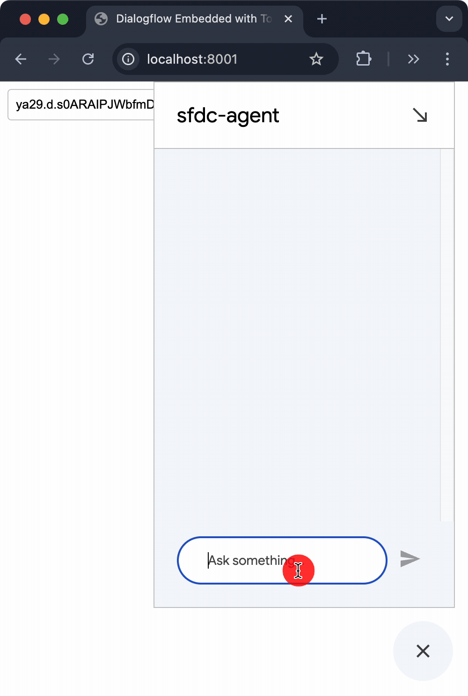

# AgentSpace VAIS Dialogflow Integration

This project demonstrates how to integrate Dialogflow CX with Salesforce using Workforce Identity Federation and the STS (Security Token Service) API for secure authentication. It allows users to authenticate with Salesforce, obtain a Google Cloud access token, and then use that token to interact with a Dialogflow CX agent embedded in a web page.

(Gemini Code Assist generated readme)




## Overview

The project consists of the following key components:

*   **`index.html`:** A web page that embeds the Dialogflow CX messenger and provides an interface for users to input their access token.
*   **`auth_flow.py`:** Python module that handles the OAuth 2.0 flow with Salesforce, including PKCE (Proof Key for Code Exchange), and exchanges the Salesforce ID token for a Google Cloud access token using the STS API.
*   **`app.py`:** A Flask application that serves the `index.html` page and provides an API endpoint (`/token`) to initiate the authentication flow and retrieve the Google Cloud access token.

## Features

*   **Secure Authentication:** Uses Salesforce OAuth 2.0 with PKCE for secure user authentication.
*   **Workforce Identity Federation:** Leverages Google Cloud's Workforce Identity Federation to exchange a Salesforce ID token for a Google Cloud access token.
*   **Dialogflow CX Integration:** Embeds a Dialogflow CX agent in a web page, allowing users to interact with the agent using the obtained access token.
*   **Token Management:** Provides a user interface to input and set the access token for the Dialogflow messenger.
* **Error Handling:** Implements error handling for various scenarios, including timeouts, authentication failures, and unexpected errors.

## Prerequisites

Before running this project, ensure you have the following:

*   **Python 3.x:**  Make sure you have Python 3 installed on your system.
*   **Salesforce OAuth App:**
    *   A Salesforce account with an OAuth app configured.
    *   The OAuth app's Consumer Key (Client ID) and Consumer Secret.
    *   The Salesforce domain (e.g., `your-domain.my.salesforce.com`).
    *   The Redirect URI set to `http://localhost:8000/callback`.
*   **Google Cloud Project:**
    *   A Google Cloud project with Dialogflow CX enabled.
    *   A Workforce Identity Pool and Provider configured.
    *   The Workforce Pool ID and Provider ID.
    *   The Billing Project Number (if applicable).
*   **Dialogflow CX Agent:** A Dialogflow CX agent created in your Google Cloud project.
*   **Python Packages:** Install the required Python packages using pip:

    ```bash
    pip install flask flask-cors requests pyjwt
    ```

## Configuration

1.  **`auth_flow.py`:**
    *   Replace the placeholder values for the following variables with your actual credentials:
        *   `SALESFORCE_CLIENT_ID`
        *   `SALESFORCE_CLIENT_SECRET`
        *   `SALESFORCE_DOMAIN`
        *   `WORKFORCE_POOL_ID`
        *   `WORKFORCE_PROVIDER_ID`
        *   `BILLING_PROJECT_NUMBER`
2.  **`index.html`:**
    *   Replace `project-number` with your Dialogflow CX project number.
    *   Replace `your-agent-id` with your Dialogflow CX agent ID.

## Setup and Run

1.  **Clone the Repository:**
    ```bash
    git clone https://github.com/krishnaji/agentspace-vais-dialogflow.git
    cd agentspace-vais-dialogflow
    ```
2. **Install Dependencies**
    ```bash
    pip install -r requirements.txt
    ```
3.  **Run the Flask Application:**
    ```bash
    python app.py
    ```
    This will start the Flask development server on `http://localhost:8001`.

4.  **Access the Web Page:**
    Open your web browser and go to `http://localhost:8001`.

5.  ** Get Google STS Token:**
    Open your web browser and go to `http://localhost:8001/token`.

## Usage

1.  **Authentication:**
    *   The web page will display a text input field and a "Set Token" button.
    *   Click on the "Get Token" button. This will redirect you to Salesforce for authentication.
    *   After successful authentication, Salesforce will redirect you back to the application, and the application will exchange the Salesforce ID token for a Google Cloud access token.
    * The access token will be displayed in the console.
2. **Set Token**
    * Copy the access token from the console.
    * Paste the access token into the input field on the web page.
    * Click the "Set Token" button.
3.  **Interact with Dialogflow:**
    *   The Dialogflow CX messenger will now be active and ready to use.
    *   You can start interacting with the Dialogflow agent.


